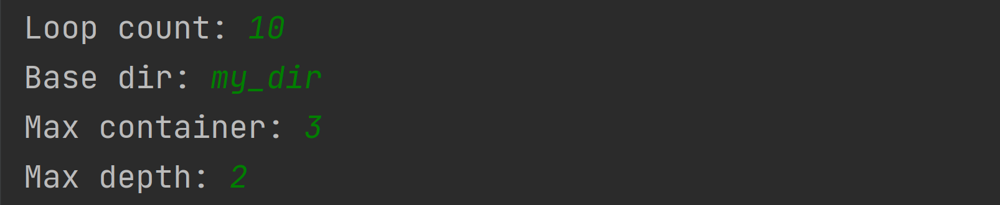
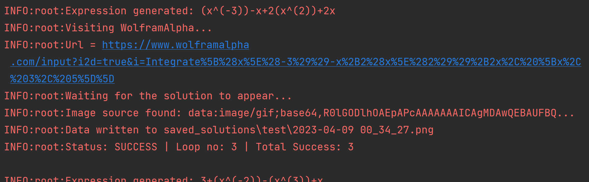
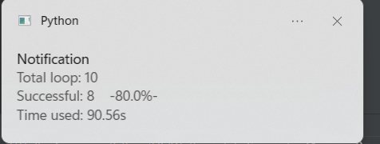

# WolframAlphaScraper


Generate integrals and scrape soltion image from www.wolframalpha.com

## Setting up
##### Shell (linux)
```commandline
git clone git@github.com:stanX19/WolframAlphaScraper.git WolframAlphaScraper
cd WolframAlphaScraper
python3 -m pip install -r requirements.txt
```
##### Command Prompt (Windows)

wsl, git bash or equivalent: 

```commandline
git clone git@github.com:stanX19/WolframAlphaScraper.git WolframAlphaScraper
```

Then, on command prompt:

```commandline
cd WolframAlphaScraper
py -m pip install -r requirements.txt
```

## Running the program
on the root, run `main.py`

you will then see:

`Loop count:` The number of integrals that is going to be generated

`Base dir: ` The file path to store all the soltion image generated in this loop. If it's not absolute, it will be saved in `WolframAlphaScraper/saved`

`max container: ` The maximum number of containers allowed in an equation

`max depth: ` The maximum depth of container a container can contain

Configuration Example



After providing the initial parameters, the program will start to run.

It will show logging at info level to indicate the progress:



When the process is complete, you will be notified via system notification:


